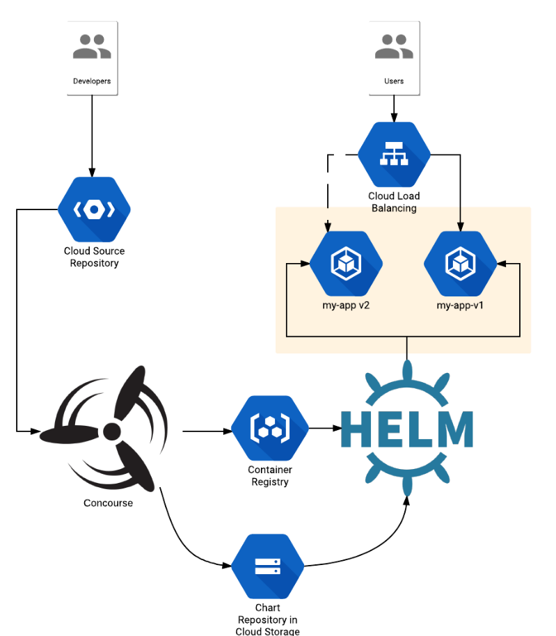

# concourse-continuous-delivery

### Create cluster

gcloud container clusters create concourse --image-type ubuntu --machine-type n1-standard-2 --zone us-central1-f

### Install Concourse

### Install Helm

### Install Concourse Chart

helm install stable/concourse --set concourse.baggageclaimDriver=overlay

### Create pipeline

export PROJECT=$(gcloud config get-value project)
export BUCKET=gs://$PROJECT-helm-repo
gsutil mb -l us-central1 $BUCKET

export CLUSTER_CA=$(kubectl get secret default-token-6fh97 -o jsonpath='{.data.ca\.crt}')
export TOKEN=$(kubectl get secret default-token-6fh97 -o jsonpath='{.data.token}' | base64 --decode)

cat > secrets.yaml <<EOF
chart_name: nginx
release_name: dev-site
bucket: $BUCKET
cluster_ca: $CLUSTER_CA
token: $TOKEN
EOF

fly -t local set-pipeline -p dev-site-deploy -c pipeline.yaml -l secrets.yaml
fly -t local unpause-pipeline -p dev-site-deploy